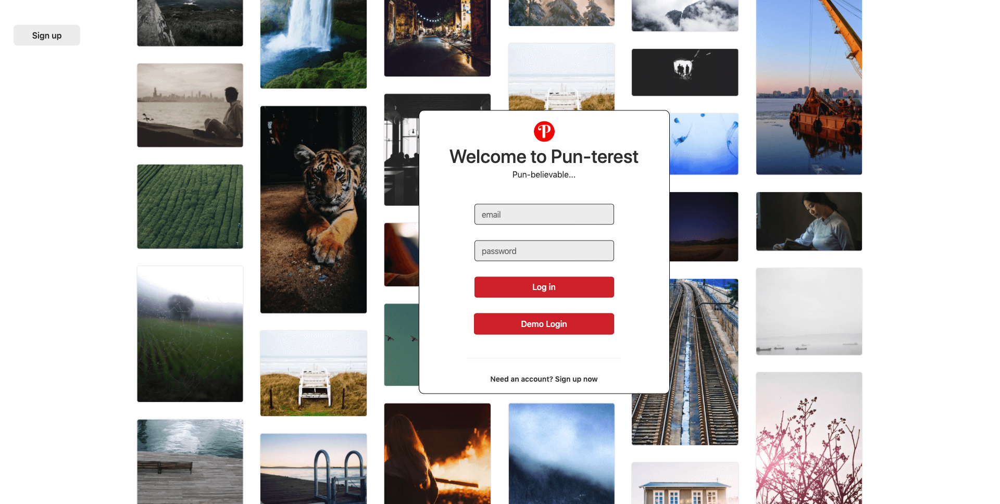
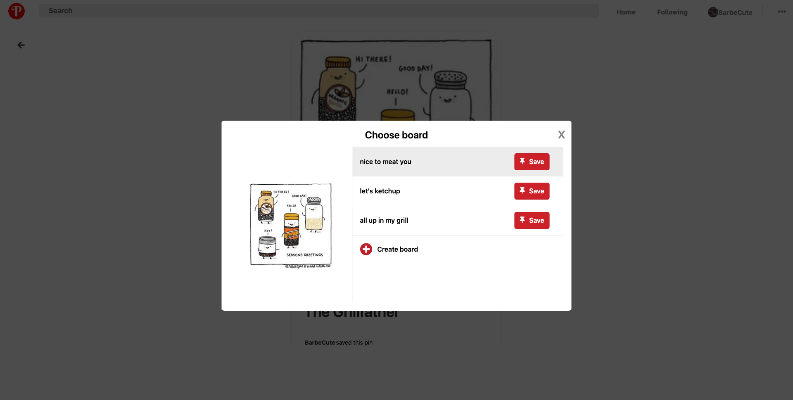

# Pun-terest

[Link to Live Site](https://pinterest-aa.herokuapp.com/#/)

Pun-terest is a full-stack web application inspired by Pinterest. This site is a social media application that allows users to create, share, and discover "punny" images and links through browsing pins and pinning them to boards. 

## Technologies 

* Ruby on Rails 
* PostgreSQL 
* React.js 
* Redux 
* AWS
* CSS

## Features 

### Users
* Modals for sign-up and log-in

### Pins
* A masonry style grid on the splash and profile pages
* Ability for the user to upload images and save them to boards
* Ability for the user to view other user pins and edit or delete their own pins

### Boards 
* Modals for the user to create, edit, and delete boards

## Future Plans

### Infinite Scroll

In order to improve scalability, infinite scroll will be implemented on the index page so that only a certain number of pins would be fetched from the database at a time. 

### User and board follows

A user could follow specific boards. If a user follows another user, it would automatically subscribe them to all of that user's boards. 